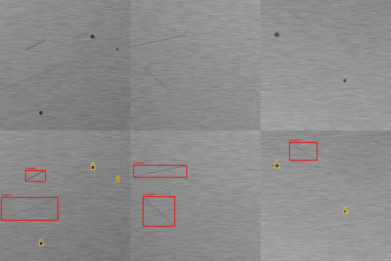

# metal-surface-defect-detection

Detecting scratches and pits on metal surface images with Python and OpenCV.
Next step is training a YOLO model and comparing it to this.

I'm doing this to learn image processing for quality inspection in production.


Top: test images, bottom: detections (red = scratch, yellow = pit)

## Data

I don't have real images yet, so `generate_synthetic.py` creates fake brushed-metal
images (grey texture + uneven lighting) and draws random scratches and pits on them.
It also saves the labels in YOLO format so I can reuse them for YOLO later.

I made two sets with different seeds:
- `data/dev` (seed 42): used for tuning the parameters
- `data/test` (seed 7): only used for the final numbers

## Approach

1. Subtract a blurred version of the image to remove the uneven lighting
2. Black-hat + threshold to find dark spots, then sort contours by shape
   (round = pit, long = scratch)
3. First version missed a lot of scratches (recall 0.53). Thin faint lines
   disappear in the texture after thresholding. So I added a line filter:
   morphological opening with thin line kernels at different angles, which only
   keeps straight lines.
4. Merge both and remove duplicates

## Results (test set, 100 images, 110 scratches, 157 pits)

| version | scratch P | scratch R | pit P | pit R |
|---|---|---|---|---|
| v1 (only step 2) | 0.98 | 0.53 | 0.96 | 0.99 |
| v2 (with line filter) | 0.97 | 0.96 | 0.96 | 0.99 |

A detection counts as correct if the class is right and IoU >= 0.3.

## Problems / limitations

- Scratches that are almost horizontal (within 20 deg) are skipped by the line
  filter, because the brushing texture is horizontal and gave too many false
  detections.
- Only synthetic data so far. Real images will have reflections, dirt etc.

## TODO

- train YOLO with `train_yolo.py` and compare
- try a real dataset (NEU surface defect database)
- check how fast it runs per image

## How to run

```
pip install -r requirements.txt
python src/generate_synthetic.py --seed 42 --out data/dev
python src/generate_synthetic.py --seed 7 --out data/test
python src/evaluate.py --data data/test
python src/detect_opencv.py --images data/test/images
pytest
```
